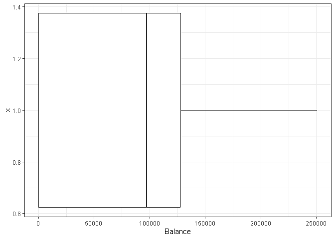
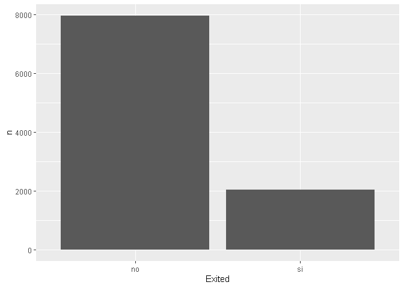
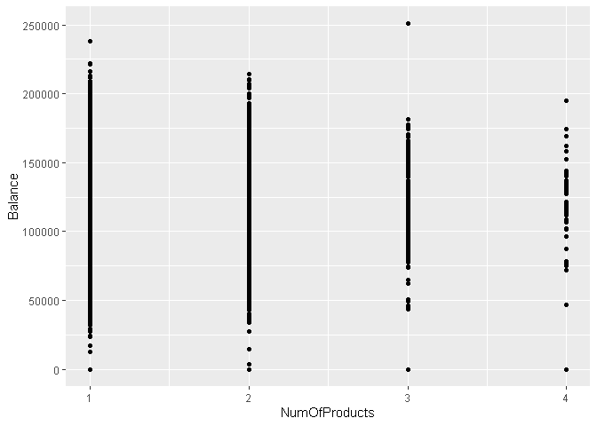
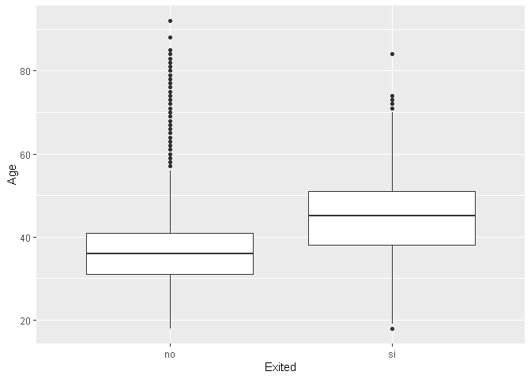
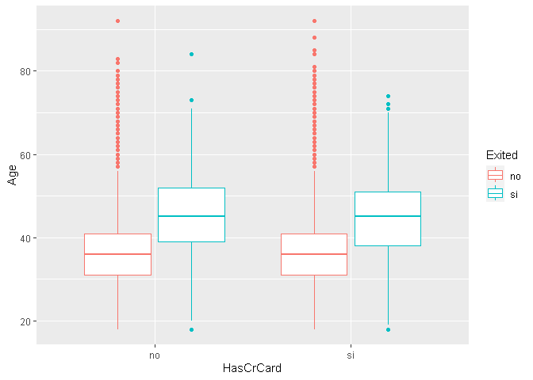

EDA con R
================

## Preliminares

``` r
library(tidyverse)
library(magrittr)
library(skimr)
library(janitor)
library(rstatix)
library(fdth)
library(corrplot)
library(ggplot2)
```

### Importacion

``` r
data <- read_csv('Data/Churn_Modelling.csv')
```

    ## Rows: 10000 Columns: 14
    ## -- Column specification --------------------------------------------------------
    ## Delimiter: ","
    ## chr  (3): Surname, Geography, Gender
    ## dbl (11): RowNumber, CustomerId, CreditScore, Age, Tenure, Balance, NumOfPro...
    ## 
    ## i Use `spec()` to retrieve the full column specification for this data.
    ## i Specify the column types or set `show_col_types = FALSE` to quiet this message.

#### Verificar y corregir columnas

``` r
data %>% glimpse
```

    ## Rows: 10,000
    ## Columns: 14
    ## $ RowNumber       <dbl> 1, 2, 3, 4, 5, 6, 7, 8, 9, 10, 11, 12, 13, 14, 15, 16,~
    ## $ CustomerId      <dbl> 15634602, 15647311, 15619304, 15701354, 15737888, 1557~
    ## $ Surname         <chr> "Hargrave", "Hill", "Onio", "Boni", "Mitchell", "Chu",~
    ## $ CreditScore     <dbl> 619, 608, 502, 699, 850, 645, 822, 376, 501, 684, 528,~
    ## $ Geography       <chr> "France", "Spain", "France", "France", "Spain", "Spain~
    ## $ Gender          <chr> "Female", "Female", "Female", "Female", "Female", "Mal~
    ## $ Age             <dbl> 42, 41, 42, 39, 43, 44, 50, 29, 44, 27, 31, 24, 34, 25~
    ## $ Tenure          <dbl> 2, 1, 8, 1, 2, 8, 7, 4, 4, 2, 6, 3, 10, 5, 7, 3, 1, 9,~
    ## $ Balance         <dbl> 0.00, 83807.86, 159660.80, 0.00, 125510.82, 113755.78,~
    ## $ NumOfProducts   <dbl> 1, 1, 3, 2, 1, 2, 2, 4, 2, 1, 2, 2, 2, 2, 2, 2, 1, 2, ~
    ## $ HasCrCard       <dbl> 1, 0, 1, 0, 1, 1, 1, 1, 0, 1, 0, 1, 1, 0, 1, 0, 1, 1, ~
    ## $ IsActiveMember  <dbl> 1, 1, 0, 0, 1, 0, 1, 0, 1, 1, 0, 0, 0, 0, 1, 1, 0, 1, ~
    ## $ EstimatedSalary <dbl> 101348.88, 112542.58, 113931.57, 93826.63, 79084.10, 1~
    ## $ Exited          <dbl> 1, 0, 1, 0, 0, 1, 0, 1, 0, 0, 0, 0, 0, 0, 0, 0, 1, 0, ~

``` r
data %>% 
  mutate(
    HasCrCard= factor(HasCrCard, levels= c(0, 1), 
                             labels= c('no', 'si') ),
    IsActiveMember= factor(IsActiveMember, levels= c(0, 1), 
                             labels= c('no', 'si') ),
    Exited= factor(Exited, levels=c(0,1), labels= c('no','si'))
    
  ) ->
  data
```

``` r
data %>% glimpse
```

    ## Rows: 10,000
    ## Columns: 14
    ## $ RowNumber       <dbl> 1, 2, 3, 4, 5, 6, 7, 8, 9, 10, 11, 12, 13, 14, 15, 16,~
    ## $ CustomerId      <dbl> 15634602, 15647311, 15619304, 15701354, 15737888, 1557~
    ## $ Surname         <chr> "Hargrave", "Hill", "Onio", "Boni", "Mitchell", "Chu",~
    ## $ CreditScore     <dbl> 619, 608, 502, 699, 850, 645, 822, 376, 501, 684, 528,~
    ## $ Geography       <chr> "France", "Spain", "France", "France", "Spain", "Spain~
    ## $ Gender          <chr> "Female", "Female", "Female", "Female", "Female", "Mal~
    ## $ Age             <dbl> 42, 41, 42, 39, 43, 44, 50, 29, 44, 27, 31, 24, 34, 25~
    ## $ Tenure          <dbl> 2, 1, 8, 1, 2, 8, 7, 4, 4, 2, 6, 3, 10, 5, 7, 3, 1, 9,~
    ## $ Balance         <dbl> 0.00, 83807.86, 159660.80, 0.00, 125510.82, 113755.78,~
    ## $ NumOfProducts   <dbl> 1, 1, 3, 2, 1, 2, 2, 4, 2, 1, 2, 2, 2, 2, 2, 2, 1, 2, ~
    ## $ HasCrCard       <fct> si, no, si, no, si, si, si, si, no, si, no, si, si, no~
    ## $ IsActiveMember  <fct> si, si, no, no, si, no, si, no, si, si, no, no, no, no~
    ## $ EstimatedSalary <dbl> 101348.88, 112542.58, 113931.57, 93826.63, 79084.10, 1~
    ## $ Exited          <fct> si, no, si, no, no, si, no, si, no, no, no, no, no, no~

# EDA

## EDA Univariado

### Todas las variables

``` r
skim( data)
```

|                                                  |       |
|:-------------------------------------------------|:------|
| Name                                             | data  |
| Number of rows                                   | 10000 |
| Number of columns                                | 14    |
| \_\_\_\_\_\_\_\_\_\_\_\_\_\_\_\_\_\_\_\_\_\_\_   |       |
| Column type frequency:                           |       |
| character                                        | 3     |
| factor                                           | 3     |
| numeric                                          | 8     |
| \_\_\_\_\_\_\_\_\_\_\_\_\_\_\_\_\_\_\_\_\_\_\_\_ |       |
| Group variables                                  | None  |

Data summary

**Variable type: character**

| skim_variable | n_missing | complete_rate | min | max | empty | n_unique | whitespace |
|:--------------|----------:|--------------:|----:|----:|------:|---------:|-----------:|
| Surname       |         0 |             1 |   2 |  23 |     0 |     2932 |          0 |
| Geography     |         0 |             1 |   5 |   7 |     0 |        3 |          0 |
| Gender        |         0 |             1 |   4 |   6 |     0 |        2 |          0 |

**Variable type: factor**

| skim_variable  | n_missing | complete_rate | ordered | n_unique | top_counts         |
|:---------------|----------:|--------------:|:--------|---------:|:-------------------|
| HasCrCard      |         0 |             1 | FALSE   |        2 | si: 7055, no: 2945 |
| IsActiveMember |         0 |             1 | FALSE   |        2 | si: 5151, no: 4849 |
| Exited         |         0 |             1 | FALSE   |        2 | no: 7963, si: 2037 |

**Variable type: numeric**

| skim_variable   | n_missing | complete_rate |        mean |       sd |          p0 |         p25 |         p50 |         p75 |       p100 | hist  |
|:----------------|----------:|--------------:|------------:|---------:|------------:|------------:|------------:|------------:|-----------:|:------|
| RowNumber       |         0 |             1 |     5000.50 |  2886.90 |        1.00 |     2500.75 |     5000.50 |     7500.25 |    10000.0 | ▇▇▇▇▇ |
| CustomerId      |         0 |             1 | 15690940.57 | 71936.19 | 15565701.00 | 15628528.25 | 15690738.00 | 15753233.75 | 15815690.0 | ▇▇▇▇▇ |
| CreditScore     |         0 |             1 |      650.53 |    96.65 |      350.00 |      584.00 |      652.00 |      718.00 |      850.0 | ▁▃▇▇▃ |
| Age             |         0 |             1 |       38.92 |    10.49 |       18.00 |       32.00 |       37.00 |       44.00 |       92.0 | ▅▇▂▁▁ |
| Tenure          |         0 |             1 |        5.01 |     2.89 |        0.00 |        3.00 |        5.00 |        7.00 |       10.0 | ▇▆▆▆▅ |
| Balance         |         0 |             1 |    76485.89 | 62397.41 |        0.00 |        0.00 |    97198.54 |   127644.24 |   250898.1 | ▇▃▇▂▁ |
| NumOfProducts   |         0 |             1 |        1.53 |     0.58 |        1.00 |        1.00 |        1.00 |        2.00 |        4.0 | ▇▇▁▁▁ |
| EstimatedSalary |         0 |             1 |   100090.24 | 57510.49 |       11.58 |    51002.11 |   100193.91 |   149388.25 |   199992.5 | ▇▇▇▇▇ |

### Variables con posibles outliers

``` r
data %>% 
  reframe( 
    tibble(
      Descrip= c('P_0', 'P_02', 'P_25', 'P_50' , 'P_75', 'P_98', 'P_100') ,
      Valor= quantile( Balance, c(0, 0.2, 0.25, 0.50 ,0.75, 0.98, 1), na.rm= T)
    )
    )
```

    ## # A tibble: 7 x 2
    ##   Descrip   Valor
    ##   <chr>     <dbl>
    ## 1 P_0          0 
    ## 2 P_02         0 
    ## 3 P_25         0 
    ## 4 P_50     97199.
    ## 5 P_75    127644.
    ## 6 P_98    176916.
    ## 7 P_100   250898.

``` r
data %>% 
  ggplot( aes(x=1, y= Balance)) +
  geom_boxplot() + 
  coord_flip() +
  theme_bw()
```

<!-- -->

``` r
data %>% 
  reframe( 
    tibble(
      Descrip= c('P_0', 'P_02', 'P_25', 'P_50' , 'P_75', 'P_97', 'P_100') ,
      Valor= quantile( CreditScore, c(0, 0.2, 0.25, 0.50 ,0.75, 0.97, 1), na.rm= T)
    )
    )
```

    ## # A tibble: 7 x 2
    ##   Descrip Valor
    ##   <chr>   <dbl>
    ## 1 P_0       350
    ## 2 P_02      566
    ## 3 P_25      584
    ## 4 P_50      652
    ## 5 P_75      718
    ## 6 P_97      838
    ## 7 P_100     850

### Balanceo

``` r
data %>% 
  group_by(Exited) %>% 
  count()
```

    ## # A tibble: 2 x 2
    ## # Groups:   Exited [2]
    ##   Exited     n
    ##   <fct>  <int>
    ## 1 no      7963
    ## 2 si      2037

``` r
data %>% 
  group_by(Exited) %>% 
  count() %>% 
  ggplot( aes(x= Exited, y= n)) +
  geom_col()
```

<!-- -->

## EDA Multivariado

### Room 11

#### CreditScore vs Exited

**Tabla**

**Grafico**

**Interpretacion**

### Room 14

### Room 15

### Room 16

``` r
data %>% ggplot(aes(x=NumOfProducts,y=Balance)) + 
  geom_point()
```

<!-- -->

``` r
data %>% ggplot(aes(x=NumOfProducts,y=Balance)) + 
  geom_point()
```

<!-- -->

``` r
data %>% ggplot(aes(x=Exited,y=Age)) + geom_boxplot()
```

<!-- -->

``` r
# realizar una prueba Anova

# Variables cualitativas
data %>%
  tabyl (HasCrCard,Exited) %>% 
  adorn_totals(c("row"))%>% adorn_percentages("col") %>% 
  adorn_pct_formatting(digits = 2)
```

    ##  HasCrCard      no      si
    ##         no  29.29%  30.09%
    ##         si  70.71%  69.91%
    ##      Total 100.00% 100.00%

``` r
#3 variables
data %>% ggplot(aes(x=HasCrCard,y=Age, color=Exited)) + 
  geom_boxplot()
```

<!-- -->
